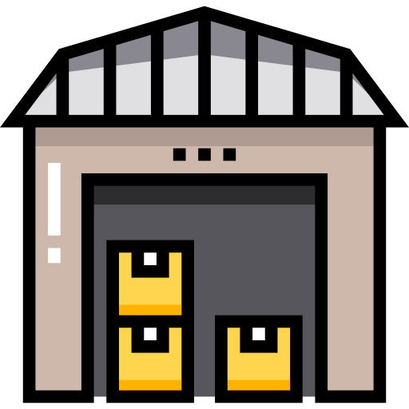
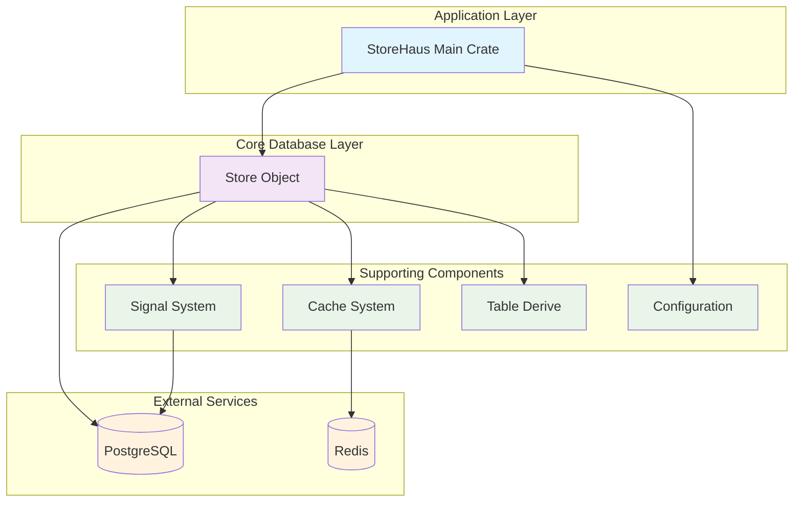

<div align="center">
  

  # /// StoreHaus ///

  **A modern Rust database abstraction library for PostgreSQL with automatic code generation, signals, caching, and advanced query capabilities**

  <!-- TODO: Uncomment when published -->
  <!-- [](https://crates.io/crates/storehaus) -->
  <!-- [](https://docs.rs/storehaus) -->
  [](LICENSE)

  ---
</div>

## Architecture

StoreHaus follows a layered architecture with clear separation of concerns and no circular dependencies:

```
┌────────────────────────────────────────────────────────────────┐
│                           STOREHAUS                            │
│                      (Application Layer)                       │
│                                                                │
│  • Unified Database API          • Store Management            │
│  • Component Orchestration       • Configuration               │
│  • Application Logic             • Auto-Migration              │
└───────────────────────────────┬────────────────────────────────┘
                                │
┌───────────────────────────────▼────────────────────────────────┐
│                          STORE_OBJECT                          │
│                        (Database Layer)                        │
│                                                                │
│  • CRUD Operations               • Advanced Queries            │
│  • Query Builder                 • Tagging System              │
│  • Error Handling                • System Fields               │
│  • Integration Layer             • Batch Operations            │
└──────┬────────────────┬────────────────┬────────────────┬──────┘
       │                │                │                │
┌──────▼──────┐  ┌──────▼──────┐  ┌──────▼──────┐  ┌──────▼──────┐
│   SIGNAL    │  │   CACHE     │  │   TABLE     │  │   CONFIG    │
│   SYSTEM    │  │   SYSTEM    │  │   DERIVE    │  │   SYSTEM    │
│             │  │             │  │             │  │             │
│ • Events    │  │ • Redis     │  │ • SQL Gen   │  │ • TOML      │
│ • Async     │  │ • TTL       │  │ • Macros    │  │ • Env Vars  │
│ • WAL       │  │ • Keys      │  │ • Analysis  │  │ • Defaults  │
└─────────────┘  └─────────────┘  └─────────────┘  └─────────────┘
```

### Component Dependencies



### Dependency Flow
- **Application Level**: `storehaus` → orchestrates all components
- **Database Level**: `store_object` → core database operations
- **Supporting Level**: Independent specialized components
  - `signal_system` → event management
  - `cache_system` → performance optimization
  - `table_derive` → code generation
  - `config` → configuration management

This design prevents circular dependencies and ensures clean, maintainable architecture.

### Crate Responsibilities

| Crate | Level | Purpose | Key Features |
|-------|-------|---------|--------------|
| **storehaus** | Application | Main orchestration | • Unified Database API<br>• Store Management<br>• Business Logic<br>• Auto-Migration |
| **store_object** | Database | Core operations | • CRUD Operations<br>• Advanced Queries<br>• Tagging System<br>• Batch Operations |
| **signal_system** | Supporting | Event management | • Async Events<br>• Type-safe Callbacks<br>• WAL Integration<br>• Real-time Notifications |
| **cache_system** | Supporting | Performance layer | • Redis Integration<br>• TTL Management<br>• Smart Key Generation<br>• Automatic Invalidation |
| **table_derive** | Supporting | Code generation | • Proc Macros<br>• SQL Generation<br>• Field Analysis<br>• Metadata Extraction |
| **config** | Supporting | Configuration | • TOML Support<br>• Environment Variables<br>• Validation<br>• Defaults Management |

## Features

StoreHaus provides a comprehensive, high-level interface for database operations:

- **Automatic System Fields** - `__created_at__`, `__updated_at__`, soft delete, `__tags__`
- **Database Indexes** - single and composite indexes with `#[index]` and `#[unique]` attributes
- **Operation Tagging** - categorize and track database operations
- **Event System** - real-time database event monitoring and callbacks
- **Redis Caching** - intelligent performance optimization with TTL
- **Auto-Migration** - seamless schema management and evolution
- **Advanced Queries** - powerful query builder with filtering, sorting, pagination

## Quick Start

### Installation

```toml
[dependencies]
storehaus = { path = "./" }
tokio = { version = "1.0", features = ["full"] }
uuid = { version = "1.0", features = ["v4", "serde"] }
serde = { version = "1.0", features = ["derive"] }

# Required peer dependencies for StoreHaus macros
sqlx = { version = "0.8", features = ["runtime-tokio", "tls-native-tls", "postgres", "uuid", "chrono"] }
async-trait = "0.1"
```

> **Note on Peer Dependencies**: StoreHaus uses procedural macros that generate code referencing `sqlx` and `async-trait`. Due to how Rust proc macros work, these dependencies must be directly available in your project's `Cargo.toml` - they cannot be accessed through re-exports. This is a standard pattern in the Rust ecosystem for libraries using derive macros.

### Basic Example

```rust
use storehaus::prelude::*;

// Define a model
#[model]
#[table(name = "users")]
pub struct User {
    #[primary_key]
    pub id: Uuid,

    #[field(create, update)]
    pub name: String,

    #[field(create, update)]
    pub email: String,
}

#[tokio::main]
async fn main() -> Result<(), Box<dyn std::error::Error>> {
    // Database configuration with connection pool settings
    let config = DatabaseConfig::new(
        "localhost".to_string(),        // host
        5432,                          // port
        "storehaus".to_string(),       // database
        "postgres".to_string(),        // username
        "password".to_string(),        // password
        1,                             // min_connections
        10,                            // max_connections
        30,                            // connection_timeout_seconds
        600,                           // idle_timeout_seconds
        3600,                          // max_lifetime_seconds
    );

    // Create StoreHaus instance
    let mut storehaus = StoreHaus::new(config).await?;

    // Auto-migrate table
    storehaus.auto_migrate::<User>(true).await?;

    // Create store
    let user_store = GenericStore::<User>::new(
        storehaus.pool().clone(),
        None, // no signals
        None, // no cache
    );

    // Register and use store
    storehaus.register_store("users".to_string(), user_store)?;
    let user_store = storehaus.get_store::<GenericStore<User>>("users")?;

    // CRUD operations
    let user = User::new(
        Uuid::new_v4(),
        "John Doe".to_string(),
        "john@example.com".to_string(),
    );

    let created = user_store.create(user, None).await?;
    println!("Created user: {}", created.name);

    Ok(())
}
```

## Architecture

```
storehaus/
├── src/                   # Main StoreHaus library code
├── store_object/          # Core database operations and traits
├── table_derive/          # Derive macros for SQL generation
├── signal_system/         # Database event notification system
├── cache_system/          # Redis-based caching layer
├── config/                # Configuration management
├── examples/              # Complete examples and tutorials
└── docs/                  # Comprehensive documentation
    ├── README.md          # Documentation index and guide
    ├── configuration.md   # Complete configuration reference
    ├── models.md          # Model definitions and usage
    ├── system-fields.md   # Automatic system fields
    ├── caching.md         # Redis caching system
    ├── signals.md         # Event monitoring and callbacks
    ├── tags.md            # Operation tagging system
    └── error-handling.md  # Error handling best practices
```

## Documentation

**[Complete Documentation Index →](docs/README.md)**

### Quick Reference
- [Configuration Guide](docs/configuration.md) - Complete setup and configuration reference
- [Model Definitions](docs/models.md) - Create data models with `#[model]` macro
- [System Fields](docs/system-fields.md) - Automatic timestamps, tags, and soft delete
- [Caching System](docs/caching.md) - Redis performance optimization
- [Signal System](docs/signals.md) - Database event monitoring and callbacks
- [Tagging System](docs/tags.md) - Operation categorization and tracking
- [Error Handling](docs/error-handling.md) - Robust application patterns

## Configuration

StoreHaus supports multiple configuration methods:

### 1. Programmatic Configuration (Quick Start)
```rust
use storehaus::prelude::*;

let config = DatabaseConfig::new(
    "localhost".to_string(), 5432, "storehaus".to_string(),
    "postgres".to_string(), "password".to_string(),
    1, 10, 30, 600, 3600,
);
```

### 2. TOML File Configuration (Recommended)
Create `storehaus.toml`:
```toml
[database]
host = "localhost"
port = 5432
database = "storehaus"
username = "postgres"
password = "password"
min_connections = 1
max_connections = 10
connection_timeout_seconds = 30
idle_timeout_seconds = 600
max_lifetime_seconds = 3600

[cache]
redis_url = "redis://localhost:6379"
pool_size = 10
timeout_ms = 5000
max_connections = 100
connection_timeout_ms = 3000

[signal]
callback_timeout_seconds = 30
max_callbacks = 100
remove_failing_callbacks = true
max_consecutive_failures = 3
cleanup_interval_seconds = 60
auto_remove_inactive_callbacks = true
inactive_callback_threshold_seconds = 300
```

Load configuration:
```rust
let config = AppConfig::load()?; // Loads from storehaus.toml
let storehaus = StoreHaus::new(config.database).await?;
```

### 3. Environment Variables
```bash
export STOREHAUS_CONFIG=/path/to/production.toml
```

**For complete configuration options, see [Configuration Guide](docs/configuration.md)**

## Setup

### With Docker Compose

```bash
# Start PostgreSQL and Redis
docker-compose up -d

# Build project
cargo build

# Run examples
cd storehaus
cargo run --example complete_integration  # Full system demo
```

### Make Commands

```bash
# Setup and development
make setup              # Initial setup for development
make dev                # Start development environment
make docker-up          # Start database services
make docker-down        # Stop all services

# Building and testing
make build              # Build project
make test               # Run tests
make check              # Format, lint, and test

# Examples (recommended way to explore StoreHaus)
make example-complete   # Full e-commerce demo (best starting point)
make examples-all       # Run all examples in sequence
make examples-help      # Detailed guide to all examples
```

## Examples

### Quick Start

**New to StoreHaus?** Follow this learning path:

```bash
# 1. Start with the overview demo
cargo run --example demo

# 2. Learn basic CRUD operations
cargo run --example 01_basic_usage

# 3. Explore advanced model features
cargo run --example 02_model_definition

# 4. Try real-world applications
cargo run --example blog_system
```

### Example Categories

#### Getting Started
- [01_basic_usage.rs](./examples/01_basic_usage.rs) - Essential CRUD operations, Model::new() method
- [02_model_definition.rs](./examples/02_model_definition.rs) - Advanced models, field types, soft delete

#### Core Features
- [signals_basic.rs](./examples/signals_basic.rs) - Event system and callbacks
- [caching_basic.rs](./examples/caching_basic.rs) - Redis caching and performance
- [tags_demo.rs](./examples/tags_demo.rs) - Tag-based categorization

#### Real-World Applications
- [ecommerce_demo.rs](./examples/ecommerce_demo.rs) - Full e-commerce platform
- [blog_system.rs](./examples/blog_system.rs) - Content management system

### Quick Commands

```bash
# Automated setup (recommended)
make example-complete       # Full e-commerce demo with setup
make examples-all           # Run all examples in sequence
make examples-help          # Detailed guide and descriptions

# Manual execution
cargo run --example demo
cargo run --example 01_basic_usage
cargo run --example blog_system
```

### Requirements

All examples require:
- PostgreSQL on `localhost:5432` with database `storehaus`
- Redis on `localhost:6379` (for caching examples)

**Quick setup:**
```bash
# Using Docker Compose (recommended)
docker-compose up -d

# Or manually
docker run -d --name postgres -e POSTGRES_DB=storehaus -e POSTGRES_PASSWORD=password -p 5432:5432 postgres:15
docker run -d --name redis -p 6379:6379 redis:7-alpine
```

**[Complete Examples Documentation →](./examples/README.md)**

## Implementation Status

### Current
- ✅ Generic store implementation
- ✅ Automatic table metadata generation
- ✅ Database connection management
- ✅ Full CRUD functionality
- ✅ Advanced query builder
- ✅ Batch operations
- ✅ Signal system for monitoring
- ✅ Redis caching
- ✅ Automatic migrations
- ✅ Operation tagging system
- ✅ Automatic system fields management
- ✅ Soft delete support
- ✅ Database index support (single and composite indexes)

### Planned
- [ ] Model relationships support
- [ ] Connection pool optimization
- [ ] Advanced caching strategies
- [ ] Transaction management
- [ ] Rate limiting system (token bucket algorithm for preventing abuse)
  - [ ] Signal system rate limiting (event emission and callback registration)
  - [ ] Cache operations rate limiting
  - [ ] Store operations rate limiting
  - [ ] Per-user and global rate limits
  - [ ] Configurable rate limit rules
- [ ] Error boundaries between layers (circuit breaker pattern for cache/signal failures)
- [ ] Configurable resilience strategies (fail-fast vs fallback)
- [ ] Retry mechanisms with exponential backoff

## License

MIT License - see LICENSE file for details.

## Acknowledgments

- Built with [Tokio](https://tokio.rs/) async runtime
- Uses [sqlx](https://github.com/launchbadge/sqlx), [redis](https://github.com/redis-rs/redis-rs)
- Icon: <a href="https://www.flaticon.com/free-icons/storehouse" title="storehouse icons">Storehouse icon created by Freepik - Flaticon</a>

---

<div align="center">
  <sub>Built with ❤️ for the Rust community</sub>
</div>