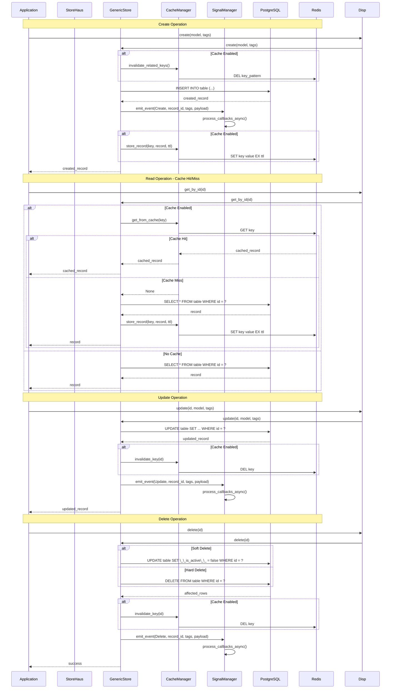

# StoreHaus Documentation

Welcome to the StoreHaus documentation! This guide will help you understand and use all features of the StoreHaus database abstraction library.

## 📚 Table of Contents

### 🚀 Getting Started
- **[Configuration Guide](configuration.md)** - Complete setup and configuration reference
- **[Model Definitions](models.md)** - How to create data models with the `#[model]` macro

### 🔧 Core Features
- **[System Fields](system-fields.md)** - Automatic timestamp, tag, and soft delete fields
- **[Caching System](caching.md)** - Redis-based performance optimization
- **[Signal System](signals.md)** - Database event monitoring and callbacks
- **[Tagging System](tags.md)** - Operation categorization and tracking

### 🛠️ Advanced Topics
- **[Error Handling](error-handling.md)** - Best practices for robust applications

### 📊 Visual Documentation
All architectural diagrams are embedded directly in the documentation for easy viewing:
  - **[System Architecture](../README.md#architecture)** - Component relationships and dependency flow
  - **[Data Flow](#data-flow)** - Complete CRUD operations with caching and signals
  - **[Signal System](signals.md)** - Event processing and callback execution
  - **[Cache System](caching.md)** - Performance optimization workflows
  - **[Configuration](configuration.md)** - Configuration management flow
  - **[Data Models](models.md)** - Model structure and SQL generation

## 🎯 Quick Navigation

### New to StoreHaus?
1. Start with **[Configuration Guide](configuration.md)** to set up your database and services
2. Learn **[Model Definitions](models.md)** to create your data structures
3. Understand **[System Fields](system-fields.md)** for automatic metadata management

### Want to Optimize Performance?
- **[Caching System](caching.md)** - Set up Redis caching for faster queries
- **[Configuration Guide](configuration.md)** - Tune connection pools and timeouts

### Building Event-Driven Applications?
- **[Signal System](signals.md)** - Monitor database changes and trigger actions
- **[Tagging System](tags.md)** - Categorize and track operations

### Need Robust Error Handling?
- **[Error Handling](error-handling.md)** - Handle failures gracefully

## 🏗️ Architecture Overview

StoreHaus follows a layered architecture:

```
┌─────────────────────────────────────────────────────────┐
│                   🏠 STOREHAUS                          │
│                 (Application Core)                      │
│  🎯 Unified Database API    🔧 Store Registry          │
│  🚀 Component Orchestration 🔄 Auto-Migration          │
│  🏗️  Business Logic         ⚙️  Configuration           │
└─────────────────────┬───────────────────────────────────┘
                      │
┌─────────────────────▼───────────────────────────────────┐
│                📦 STORE_OBJECT                          │
│               (Database Engine)                         │
│  🗄️  CRUD Operations       🔍 Advanced Queries         │
│  🔗 Query Builder          🏷️  Operation Tagging       │
│  ⚠️  Error Handling        🔧 System Fields Management │
│  🔌 Component Integration  📊 Batch Operations         │
└─────┬─────────┬─────────────┬─────────────┬─────────────┘
      │         │             │             │
┌─────▼───┐ ┌───▼────┐ ┌──────▼────┐ ┌──────▼──────┐
│📡 SIGNAL│ │⚡ CACHE │ │🛠️ TABLE   │ │⚙️ CONFIG   │
│ SYSTEM  │ │ SYSTEM │ │ DERIVE    │ │ SYSTEM     │
│         │ │        │ │           │ │            │
│• Events │ │• Redis │ │• SQL Gen  │ │• TOML      │
│• WAL    │ │• TTL   │ │• Macros   │ │• Env Vars  │
│• Async  │ │• LRU   │ │• Analysis │ │• Validation│
└─────────┘ └────────┘ └───────────┘ └────────────┘
```

## Data Flow

StoreHaus provides comprehensive data flow management with automatic caching, event emission, and error handling:



### Key Features in Data Flow
- **Smart Caching**: TTL-based expiration, automatic invalidation, error resilience
- **Async Signals**: Background callback processing, automatic cleanup of failed callbacks
- **Flexible Operations**: Support for both soft and hard deletes
- **Error Handling**: Cache failures don't break database operations

## 📖 Documentation Structure

### Component Documentation
Each major component has detailed documentation:

- **Models** (`table_derive`) - Proc macros for SQL generation
- **Core** (`store_object`) - Database operations and queries
- **Signals** (`signal_system`) - Event monitoring and callbacks
- **Cache** (`cache_system`) - Redis integration and performance
- **Config** (`config`) - Configuration management

### Examples
Practical examples are available in the [`examples/`](../examples/) directory:

- **[01_basic_usage.rs](../examples/01_basic_usage.rs)** - Essential CRUD operations
- **[02_model_definition.rs](../examples/02_model_definition.rs)** - Advanced model features
- **[caching_basic.rs](../examples/caching_basic.rs)** - Redis caching
- **[signals_basic.rs](../examples/signals_basic.rs)** - Event handling
- **[blog_system.rs](../examples/blog_system.rs)** - Complete application

## 🔗 Cross-References

### Related Concepts
- **System Fields** ↔ **Model Definitions** - Models automatically get system fields
- **Signals** ↔ **Tagging** - Signal events include operation tags
- **Caching** ↔ **Configuration** - Cache settings configured in main config
- **Error Handling** ↔ **All Components** - Error patterns used throughout

### Configuration Dependencies
- **Database** - Required for all operations
- **Redis** - Optional, needed for caching features
- **Signal System** - Optional, for event monitoring

## 🚀 Quick Start Checklist

- [ ] **Setup** - Configure database and optional Redis
- [ ] **Models** - Define your data structures with `#[model]`
- [ ] **Store** - Create and register stores with StoreHaus
- [ ] **Operations** - Use CRUD operations with automatic system fields
- [ ] **Optimize** - Add caching and monitoring as needed

## 🛟 Getting Help

### Common Issues
- **Setup Problems** → [Configuration Guide](configuration.md) troubleshooting section
- **Model Errors** → [Model Definitions](models.md) attributes reference
- **Performance** → [Caching System](caching.md) optimization guide
- **Events Not Firing** → [Signal System](signals.md) debugging section

### Best Practices
Each documentation page includes:
- ✅ **Do** and ❌ **Don't** examples
- 🎯 **Performance tips**
- 🔒 **Security considerations**
- 🐛 **Common pitfalls** and solutions

## 📝 Contributing to Documentation

To improve this documentation:

1. **Found an error?** - Update the relevant `.md` file
2. **Missing example?** - Add code examples with explanations
3. **New feature?** - Document it following existing patterns
4. **Unclear section?** - Add more detailed explanations

---

**Next:** Start with the [Configuration Guide](configuration.md) to set up StoreHaus in your project.