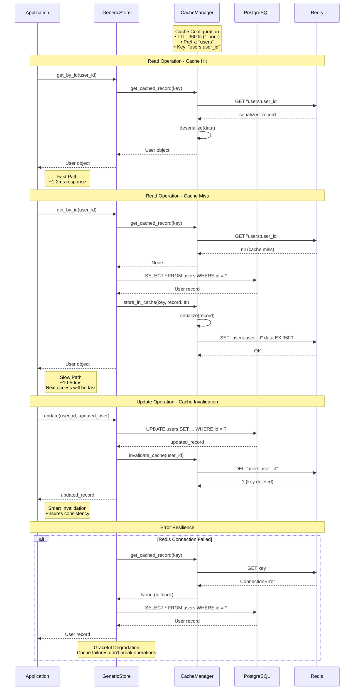

# Caching System

StoreHaus provides a Redis-based caching layer that automatically caches database queries and invalidates cache entries when data changes. The caching system is designed to be transparent and requires minimal configuration.

## Overview

The caching system provides intelligent performance optimization with automatic cache management:



### Cache Key Strategies
```
• Individual Records: "prefix:id"
• Query Results: "prefix:query:hash"
• User Sessions: "sessions:user_id"
• Temporary Data: "temp:operation_id"
```

### TTL Strategies
```
• Short-lived: 300s (5 min) - real-time data
• Medium-lived: 3600s (1 hour) - user data
• Long-lived: 86400s (24 hours) - reference data
```

### Performance Targets
```
• Hit Rate: 85-95% (target)
• Miss Rate: 5-15%
• Average Response Time: <2ms
• Memory Usage: Monitor for eviction
```

The caching system provides:

- **Automatic caching** for `get_by_id()` operations
- **Smart invalidation** on updates and deletes
- **Configurable TTL** per store or globally
- **Custom cache prefixes** for namespace isolation
- **Error resilience** - cache failures don't break database operations

## Basic Setup

### Redis Configuration

First, ensure Redis is running:

```bash
# Using Docker Compose (recommended)
docker-compose up -d redis

# Or install Redis locally
brew install redis
redis-server
```

### Cache Configuration

```rust
use cache_system::{CacheConfig, CacheManager};
use store_object::generic_store::{GenericStore, CacheParams};
use std::sync::Arc;

#[tokio::main]
async fn main() -> Result<(), Box<dyn std::error::Error>> {
    // Configure cache
    let cache_config = CacheConfig::new(
        "redis://localhost:6379".to_string(),  // Redis URL
        3600,                                   // Default TTL (1 hour)
        "myapp".to_string(),                   // Global prefix
    );

    // Create cache manager
    let cache_manager = Arc::new(CacheManager::new(cache_config)?);

    // Create store with caching
    let cache_params = CacheParams::new(cache_manager.clone());
    let user_store = GenericStore::<User>::new(
        db_pool,
        None,                    // No signals
        Some(cache_params),      // Enable caching
    );

    Ok(())
}
```

## Cache Configuration Options

### Global Cache Settings

```rust
let cache_config = CacheConfig::new(
    "redis://localhost:6379".to_string(),
    3600,                                 // Default TTL in seconds
    "storehaus".to_string(),             // Global prefix for all keys
)
.with_pool_size(10)                      // Redis connection pool size
.with_timeout(5000);                     // Operation timeout in milliseconds
```

### Per-Store Cache Settings

```rust
// Basic cache setup
let basic_cache = CacheParams::new(cache_manager.clone());

// Custom TTL for specific store
let short_ttl_cache = CacheParams::new(cache_manager.clone())
    .with_ttl(300);  // 5 minutes

// Custom prefix and TTL
let custom_cache = CacheParams::new(cache_manager.clone())
    .with_ttl(7200)                           // 2 hours
    .with_prefix("users_premium".to_string()); // Custom prefix
```

### Multiple Cache Configurations

```rust
// Different caching strategies for different stores
let user_cache = CacheParams::new(cache_manager.clone())
    .with_ttl(1800)                          // 30 minutes
    .with_prefix("users".to_string());

let session_cache = CacheParams::new(cache_manager.clone())
    .with_ttl(300)                           // 5 minutes (frequent changes)
    .with_prefix("sessions".to_string());

let product_cache = CacheParams::new(cache_manager.clone())
    .with_ttl(7200)                          // 2 hours (infrequent changes)
    .with_prefix("products".to_string());

// Create stores with different cache configurations
let user_store = GenericStore::<User>::new(db_pool.clone(), None, Some(user_cache));
let session_store = GenericStore::<Session>::new(db_pool.clone(), None, Some(session_cache));
let product_store = GenericStore::<Product>::new(db_pool.clone(), None, Some(product_cache));
```

## Cached Operations

### Automatic Caching

The following operations are automatically cached:

#### `get_by_id()`
```rust
// First call: Database query + cache storage
let user = user_store.get_by_id(&user_id).await?;

// Subsequent calls: Cache hit (no database query)
let same_user = user_store.get_by_id(&user_id).await?; // From cache!
```

### Cache Invalidation

Cache entries are automatically invalidated on:

#### Updates
```rust
// This invalidates cache for this specific record
let updated = user_store.update(&user_id, updated_user, None).await?;

// Next get_by_id will go to database and refresh cache
let fresh_user = user_store.get_by_id(&user_id).await?; // Database query
```

#### Deletes
```rust
// This removes the record from cache
let deleted = user_store.delete(&user_id).await?;

// get_by_id returns None (from database, not cached)
let result = user_store.get_by_id(&user_id).await?; // None
```

#### Batch Operations
```rust
// Invalidates cache for all updated records
let updates = vec![(id1, user1), (id2, user2)];
let results = user_store.update_many(updates).await?;

// All affected records are removed from cache
```

## Cache Key Structure

Cache keys follow a hierarchical structure:

```
{global_prefix}:{store_prefix}:{record_id}
```

### Examples

```rust
// Global prefix: "myapp"
// Store prefix: "users" (from table name)
// Record ID: "123e4567-e89b-12d3-a456-426614174000"
// Final key: "myapp:users:123e4567-e89b-12d3-a456-426614174000"

// With custom store prefix: "premium_users"
// Final key: "myapp:premium_users:123e4567-e89b-12d3-a456-426614174000"
```

## Cache Monitoring

### Cache Statistics

```rust
// Check cache manager statistics
let stats = cache_manager.get_stats().await?;
println!("Cache hits: {}", stats.hits);
println!("Cache misses: {}", stats.misses);
println!("Hit rate: {:.2}%", stats.hit_rate());
```

### Cache Health Check

```rust
// Test cache connectivity
match cache_manager.health_check().await {
    Ok(_) => println!("Cache is healthy"),
    Err(e) => println!("Cache error: {}", e),
}
```

## Advanced Usage

### Manual Cache Operations

While the system handles caching automatically, you can also interact with cache directly:

```rust
// Manual cache operations (use sparingly)
let cache_manager = store.cache_manager()?;

// Manual set
cache_manager.set_record("users", "user123", &user_data, 3600).await?;

// Manual get
let cached_user: Option<User> = cache_manager.get_record("users", "user123").await?;

// Manual delete
cache_manager.delete_record("users", "user123").await?;

// Invalidate all records for a prefix
cache_manager.invalidate_queries("users").await?;
```

### Cache Warming

```rust
// Warm cache with frequently accessed records
async fn warm_cache(user_store: &GenericStore<User>) -> Result<(), StorehausError> {
    let frequent_user_ids = get_frequent_user_ids().await?;

    for user_id in frequent_user_ids {
        // This will cache the record
        let _ = user_store.get_by_id(&user_id).await?;
    }

    println!("Cache warmed with {} records", frequent_user_ids.len());
    Ok(())
}
```

### Conditional Caching

```rust
// Different stores can have different cache settings
async fn create_stores_with_conditional_caching(
    cache_manager: Arc<CacheManager>,
    db_pool: DbPool,
) -> Result<(), Box<dyn std::error::Error>> {

    // High-frequency, rarely changing data: Long TTL
    let product_cache = CacheParams::new(cache_manager.clone())
        .with_ttl(14400); // 4 hours

    // User data: Medium TTL
    let user_cache = CacheParams::new(cache_manager.clone())
        .with_ttl(1800); // 30 minutes

    // Session data: Short TTL
    let session_cache = CacheParams::new(cache_manager.clone())
        .with_ttl(300); // 5 minutes

    // Analytics data: No caching (always fresh)
    let analytics_store = GenericStore::<AnalyticsEvent>::new(
        db_pool.clone(),
        None,
        None, // No cache for frequently changing analytics data
    );

    Ok(())
}
```

## Error Handling

### Cache Resilience

Cache failures don't break database operations:

```rust
// Even if Redis is down, database operations continue
let user = user_store.get_by_id(&user_id).await?; // Works even without cache

// Cache errors are logged but don't propagate
let updated = user_store.update(&user_id, user, None).await?; // Always works
```

### Cache Error Types

```rust
use cache_system::CacheError;

match cache_manager.get_record::<User>("users", "user123").await {
    Ok(Some(user)) => println!("Cache hit: {}", user.name),
    Ok(None) => println!("Cache miss"),
    Err(CacheError::ConnectionError(_)) => {
        println!("Redis connection failed - falling back to database");
        // Fall back to database query
    }
    Err(CacheError::SerializationError(_)) => {
        println!("Cache data corrupted - invalidating");
        // Invalidate corrupted cache entry
    }
    Err(e) => println!("Other cache error: {}", e),
}
```

## Performance Tuning

### Cache Size Management

```rust
// Configure Redis memory management
// In redis.conf or via CLI:
// maxmemory 256mb
// maxmemory-policy allkeys-lru  # Evict least recently used keys
```

### Connection Pooling

```rust
let cache_config = CacheConfig::new(
    "redis://localhost:6379".to_string(),
    3600,
    "myapp".to_string(),
)
.with_pool_size(20)          // Increase for high concurrency
.with_timeout(2000)          // Reduce timeout for faster failures
.with_retry_attempts(3)      // Retry failed operations
.with_retry_delay(100);      // Delay between retries (ms)
```

### TTL Strategy

```rust
// Choose TTL based on data access patterns

// Frequently read, rarely updated: Long TTL
let config_cache = CacheParams::new(cache_manager.clone())
    .with_ttl(86400); // 24 hours

// Frequently updated: Short TTL or no cache
let counter_cache = CacheParams::new(cache_manager.clone())
    .with_ttl(60); // 1 minute

// User sessions: Moderate TTL
let session_cache = CacheParams::new(cache_manager.clone())
    .with_ttl(1800); // 30 minutes
```

## Best Practices

### Cache Key Design

```rust
// Use meaningful prefixes for different environments
let dev_cache = CacheConfig::new(
    "redis://localhost:6379".to_string(),
    3600,
    "myapp_dev".to_string(), // Environment-specific prefix
);

let prod_cache = CacheConfig::new(
    "redis://prod-redis:6379".to_string(),
    3600,
    "myapp_prod".to_string(), // Different prefix for production
);
```

### Cache Invalidation Strategy

```rust
// Tag-based cache invalidation (conceptual - not currently implemented)
// When implementing custom cache logic, consider:

async fn invalidate_user_related_cache(user_id: &Uuid) -> Result<(), CacheError> {
    let cache_manager = get_cache_manager();

    // Invalidate direct user cache
    cache_manager.delete_record("users", &user_id.to_string()).await?;

    // Invalidate related caches
    cache_manager.delete_pattern(&format!("user_sessions:{}:*", user_id)).await?;
    cache_manager.delete_pattern(&format!("user_preferences:{}:*", user_id)).await?;

    Ok(())
}
```

### Monitoring and Alerting

```rust
// Monitor cache performance
async fn monitor_cache_health(cache_manager: &CacheManager) -> Result<(), Box<dyn std::error::Error>> {
    let stats = cache_manager.get_stats().await?;

    if stats.hit_rate() < 0.7 { // Less than 70% hit rate
        alert!("Cache hit rate is low: {:.2}%", stats.hit_rate());
    }

    Ok(())

    if stats.connection_errors > 10 {
        alert!("High cache connection error count: {}", stats.connection_errors);
    }
}
```

### Development vs Production

```rust
// Development: Shorter TTL for testing
#[cfg(debug_assertions)]
let cache_config = CacheConfig::new(
    "redis://localhost:6379".to_string(),
    300, // 5 minutes in development
    "myapp_dev".to_string(),
);

// Production: Longer TTL for performance
#[cfg(not(debug_assertions))]
let cache_config = CacheConfig::new(
    "redis://prod-redis:6379".to_string(),
    3600, // 1 hour in production
    "myapp_prod".to_string(),
);
```