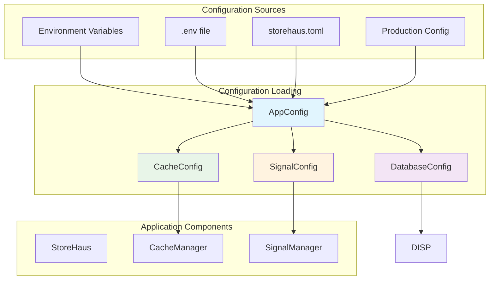

# StoreHaus Configuration Guide

This guide covers all configuration options available in StoreHaus, including database connections, Redis caching, and signal system settings.

## 📋 Table of Contents

- [Overview](#overview)
- [Configuration Methods](#configuration-methods)
- [Database Configuration](#database-configuration)
- [Cache Configuration](#cache-configuration)
- [Signal System Configuration](#signal-system-configuration)
- [Complete Configuration Example](#complete-configuration-example)
- [Environment Variables](#environment-variables)
- [Validation Rules](#validation-rules)
- [Best Practices](#best-practices)

## Overview

StoreHaus supports multiple configuration approaches with a flexible configuration management system:



### Configuration Loading Priority
1. **STOREHAUS_CONFIG** environment variable
2. **.env** file for STOREHAUS_CONFIG
3. **./storehaus.toml** (default location)
4. Return error if none found

### Configuration Structure
```rust
pub struct AppConfig {
    pub database: DatabaseConfig,  // PostgreSQL connection settings
    pub cache: CacheConfig,        // Redis cache configuration
    pub signal: SignalConfig,      // Event system configuration
}
```

### Validation Rules
- ✅ Database host cannot be empty
- ✅ Port must be 1-65535
- ✅ min_connections ≤ max_connections
- ✅ All timeout values > 0
- ✅ Redis URL must be valid
- ✅ Cache pool_size > 0
- ✅ Signal max_consecutive_failures > 0

1. **Programmatic Configuration** - Create config objects directly in code
2. **TOML File Configuration** - Load from `storehaus.toml` file
3. **Environment Variable Configuration** - Override values with env vars

## Configuration Methods

### 1. Programmatic Configuration

Create configuration objects directly in your code:

```rust
use storehaus::prelude::*;

// Database configuration
let db_config = DatabaseConfig::new(
    "localhost".to_string(),        // host
    5432,                          // port
    "myapp".to_string(),           // database
    "postgres".to_string(),        // username
    "password".to_string(),        // password
    1,                             // min_connections
    10,                            // max_connections
    30,                            // connection_timeout_seconds
    600,                           // idle_timeout_seconds
    3600,                          // max_lifetime_seconds
);

// Cache configuration
let cache_config = CacheConfig::new(
    "redis://localhost:6379".to_string(),  // redis_url
    10,                                     // pool_size
    5000,                                   // timeout_ms
    100,                                    // max_connections
    3000,                                   // connection_timeout_ms
);

// Signal configuration
let signal_config = SignalConfig::new(
    30,      // callback_timeout_seconds
    100,     // max_callbacks
    true,    // remove_failing_callbacks
    3,       // max_consecutive_failures
    60,      // cleanup_interval_seconds
    true,    // auto_remove_inactive_callbacks
    300,     // inactive_callback_threshold_seconds
);
```

### 2. TOML File Configuration

Create a `storehaus.toml` file in your project root:

```toml
[database]
host = "localhost"
port = 5432
database = "myapp"
username = "postgres"
password = "password"
min_connections = 1
max_connections = 10
connection_timeout_seconds = 30
idle_timeout_seconds = 600
max_lifetime_seconds = 3600

[cache]
redis_url = "redis://localhost:6379"
pool_size = 10
timeout_ms = 5000
max_connections = 100
connection_timeout_ms = 3000

[signal]
callback_timeout_seconds = 30
max_callbacks = 100
remove_failing_callbacks = true
max_consecutive_failures = 3
cleanup_interval_seconds = 60
auto_remove_inactive_callbacks = true
inactive_callback_threshold_seconds = 300
```

Load the configuration:

```rust
use storehaus::prelude::*;

// Load from default location (storehaus.toml)
let config = AppConfig::load()?;

// Or load from custom path
let config = AppConfig::from_file("path/to/custom.toml")?;
```

### 3. Environment Variable Override

Set the config file path via environment variable:

```bash
export STOREHAUS_CONFIG=/path/to/production.toml
```

Or create a `.env` file:

```env
STOREHAUS_CONFIG=./config/production.toml
```

## Database Configuration

### DatabaseConfig Options

| Parameter | Type | Description | Default | Min | Max |
|-----------|------|-------------|---------|-----|-----|
| `host` | String | PostgreSQL server hostname | `"localhost"` | - | - |
| `port` | u16 | PostgreSQL server port | `5432` | 1 | 65535 |
| `database` | String | Database name | **Required** | - | - |
| `username` | String | Database username | **Required** | - | - |
| `password` | String | Database password | **Required** | - | - |
| `min_connections` | u32 | Minimum connections in pool | `1` | 1 | max_connections |
| `max_connections` | u32 | Maximum connections in pool | `10` | min_connections | - |
| `connection_timeout_seconds` | u64 | Connection establishment timeout | `30` | 1 | - |
| `idle_timeout_seconds` | u64 | Connection idle timeout | `600` | 0 | - |
| `max_lifetime_seconds` | u64 | Maximum connection lifetime | `3600` | 0 | - |

### Database Configuration Examples

#### Development Environment
```rust
let config = DatabaseConfig::new(
    "localhost".to_string(),
    5432,
    "myapp_dev".to_string(),
    "postgres".to_string(),
    "password".to_string(),
    1,    // min_connections - low for development
    5,    // max_connections - low for development
    30,   // connection_timeout_seconds
    300,  // idle_timeout_seconds - shorter for dev
    1800, // max_lifetime_seconds - shorter for dev
);
```

#### Production Environment
```rust
let config = DatabaseConfig::new(
    "db.production.com".to_string(),
    5432,
    "myapp_prod".to_string(),
    "prod_user".to_string(),
    "secure_password".to_string(),
    5,    // min_connections - higher for production
    50,   // max_connections - much higher for production
    30,   // connection_timeout_seconds
    900,  // idle_timeout_seconds - longer for prod
    7200, // max_lifetime_seconds - longer for prod
);
```

#### High-Performance Setup
```rust
let config = DatabaseConfig::new(
    "db-primary.example.com".to_string(),
    5432,
    "myapp".to_string(),
    "app_user".to_string(),
    "strong_password".to_string(),
    10,   // min_connections - keep connections ready
    100,  // max_connections - handle high load
    15,   // connection_timeout_seconds - faster timeout
    1800, // idle_timeout_seconds
    14400,// max_lifetime_seconds - 4 hours
);
```

## Cache Configuration

### CacheConfig Options

| Parameter | Type | Description | Default | Min | Max |
|-----------|------|-------------|---------|-----|-----|
| `redis_url` | String | Redis connection URL | **Required** | - | - |
| `pool_size` | u32 | Connection pool size | `10` | 1 | - |
| `timeout_ms` | u64 | Operation timeout in milliseconds | `5000` | 1 | - |
| `max_connections` | u32 | Maximum connections to Redis | `100` | 1 | - |
| `connection_timeout_ms` | u64 | Connection establishment timeout | `3000` | 1 | - |

### Cache Configuration Examples

#### Basic Redis Setup
```rust
let config = CacheConfig::new(
    "redis://localhost:6379".to_string(),
    10,   // pool_size
    5000, // timeout_ms - 5 seconds
    50,   // max_connections
    3000, // connection_timeout_ms - 3 seconds
);
```

#### Redis with Authentication
```rust
let config = CacheConfig::new(
    "redis://:password@localhost:6379".to_string(),
    15,   // pool_size
    8000, // timeout_ms - longer for network latency
    100,  // max_connections
    5000, // connection_timeout_ms
);
```

#### Redis Cluster
```rust
let config = CacheConfig::new(
    "redis://redis-cluster.example.com:6379".to_string(),
    20,   // pool_size - higher for cluster
    10000,// timeout_ms - longer for cluster operations
    200,  // max_connections - more for distributed setup
    8000, // connection_timeout_ms
);
```

#### High-Performance Cache
```rust
let config = CacheConfig::new(
    "redis://cache.example.com:6379".to_string(),
    50,   // pool_size - large pool
    2000, // timeout_ms - fast timeout
    500,  // max_connections - handle burst traffic
    1000, // connection_timeout_ms - quick connection
);
```

## Signal System Configuration

### SignalConfig Options

| Parameter | Type | Description | Default | Min | Max |
|-----------|------|-------------|---------|-----|-----|
| `callback_timeout_seconds` | u64 | Timeout for callback execution | `30` | 1 | - |
| `max_callbacks` | usize | Maximum number of callbacks | `100` | 1 | - |
| `remove_failing_callbacks` | bool | Auto-remove failing callbacks | `true` | - | - |
| `max_consecutive_failures` | u32 | Failures before callback removal | `3` | 1 | - |
| `cleanup_interval_seconds` | u64 | Cleanup task interval | `60` | 1 | - |
| `auto_remove_inactive_callbacks` | bool | Remove inactive callbacks | `true` | - | - |
| `inactive_callback_threshold_seconds` | u64 | Inactivity threshold | `300` | 1 | - |

### Signal Configuration Examples

#### Conservative Setup (High Reliability)
```rust
let config = SignalConfig::new(
    60,    // callback_timeout_seconds - longer timeout
    50,    // max_callbacks - fewer callbacks
    false, // remove_failing_callbacks - keep failing callbacks
    10,    // max_consecutive_failures - more tolerance
    300,   // cleanup_interval_seconds - less frequent cleanup
    false, // auto_remove_inactive_callbacks - manual management
    1800,  // inactive_callback_threshold_seconds - longer threshold
);
```

#### Aggressive Setup (High Performance)
```rust
let config = SignalConfig::new(
    10,   // callback_timeout_seconds - quick timeout
    200,  // max_callbacks - more callbacks allowed
    true, // remove_failing_callbacks - auto-remove failures
    2,    // max_consecutive_failures - low tolerance
    30,   // cleanup_interval_seconds - frequent cleanup
    true, // auto_remove_inactive_callbacks - auto-cleanup
    120,  // inactive_callback_threshold_seconds - quick removal
);
```

#### Balanced Setup (Recommended)
```rust
let config = SignalConfig::new(
    30,   // callback_timeout_seconds
    100,  // max_callbacks
    true, // remove_failing_callbacks
    3,    // max_consecutive_failures
    60,   // cleanup_interval_seconds
    true, // auto_remove_inactive_callbacks
    300,  // inactive_callback_threshold_seconds
);
```

## Complete Configuration Example

### TOML Configuration

```toml
# storehaus.toml - Complete configuration example

[database]
host = "db.example.com"
port = 5432
database = "production_app"
username = "app_user"
password = "secure_password_123"
min_connections = 5
max_connections = 50
connection_timeout_seconds = 30
idle_timeout_seconds = 900
max_lifetime_seconds = 7200

[cache]
redis_url = "redis://:cache_password@cache.example.com:6379"
pool_size = 20
timeout_ms = 5000
max_connections = 100
connection_timeout_ms = 3000

[signal]
callback_timeout_seconds = 30
max_callbacks = 100
remove_failing_callbacks = true
max_consecutive_failures = 3
cleanup_interval_seconds = 60
auto_remove_inactive_callbacks = true
inactive_callback_threshold_seconds = 300
```

### Loading and Using Configuration

```rust
use storehaus::prelude::*;

#[tokio::main]
async fn main() -> Result<(), Box<dyn std::error::Error>> {
    // Load complete configuration
    let app_config = AppConfig::load()?;

    // Create StoreHaus with database config
    let mut storehaus = StoreHaus::new(app_config.database).await?;

    // Create cache manager
    let cache_manager = CacheManager::new(app_config.cache)?;

    // Create signal manager
    let signal_manager = SignalManager::new(app_config.signal);

    // Use configurations...

    Ok(())
}
```

## Environment Variables

You can override configuration file location using environment variables:

### Setting Config Path

```bash
# Set via environment variable
export STOREHAUS_CONFIG=/path/to/config.toml

# Or use .env file
echo "STOREHAUS_CONFIG=./config/production.toml" > .env
```

### Environment-Specific Configs

```bash
# Development
export STOREHAUS_CONFIG=./config/development.toml

# Testing
export STOREHAUS_CONFIG=./config/testing.toml

# Production
export STOREHAUS_CONFIG=./config/production.toml
```

## Validation Rules

StoreHaus automatically validates configurations with these rules:

### Database Validation
- ✅ Host cannot be empty
- ✅ Port must be between 1-65535
- ✅ Database name cannot be empty
- ✅ Username cannot be empty
- ✅ min_connections must be ≥ 1
- ✅ max_connections must be ≥ min_connections
- ✅ connection_timeout_seconds must be > 0

### Cache Validation
- ✅ Redis URL cannot be empty
- ✅ pool_size must be > 0
- ✅ timeout_ms must be > 0
- ✅ max_connections must be > 0
- ✅ connection_timeout_ms must be > 0

### Signal Validation
- ✅ max_consecutive_failures must be > 0
- ✅ cleanup_interval_seconds must be > 0

## Best Practices

### 🎯 General Guidelines

1. **Use TOML files for production** - More maintainable than hardcoded values
2. **Set appropriate timeouts** - Balance responsiveness vs reliability
3. **Size connection pools correctly** - Consider your expected load
4. **Use environment-specific configs** - Different settings for dev/staging/prod
5. **Validate in CI/CD** - Test configuration files in your pipeline

### 🔒 Security Best Practices

1. **Never commit passwords** - Use environment variables or secrets management
2. **Use strong passwords** - Especially for production databases
3. **Limit connection permissions** - Create dedicated database users
4. **Enable SSL/TLS** - For production database connections
5. **Rotate credentials regularly** - Update passwords periodically

### ⚡ Performance Tuning

#### Database Connection Pool
- **Development**: 1-5 connections
- **Staging**: 5-20 connections
- **Production**: 20-100+ connections (based on load)

#### Cache Settings
- **Low latency networks**: Short timeouts (1-3 seconds)
- **High latency networks**: Longer timeouts (5-10 seconds)
- **High throughput**: Larger connection pools

#### Signal System
- **Real-time applications**: Short timeouts, aggressive cleanup
- **Batch processing**: Longer timeouts, conservative cleanup
- **Mission-critical**: Disable auto-removal of failing callbacks

### 📊 Monitoring and Observability

Consider these settings for monitoring:

```toml
[signal]
# Enable detailed callback monitoring
callback_timeout_seconds = 30
remove_failing_callbacks = false  # Keep for analysis
max_consecutive_failures = 5      # Higher threshold
auto_remove_inactive_callbacks = false  # Manual review

[database]
# Connection pool monitoring
min_connections = 5
max_connections = 50
idle_timeout_seconds = 600  # Reasonable for monitoring

[cache]
# Cache performance monitoring
timeout_ms = 8000          # Allow time for monitoring
pool_size = 20            # Adequate for metrics collection
```

### 🚀 Deployment Configurations

#### Docker Compose Example

```yaml
# docker-compose.yml
version: '3.8'
services:
  app:
    build: .
    environment:
      - STOREHAUS_CONFIG=/app/config/docker.toml
    volumes:
      - ./config:/app/config
```

#### Kubernetes ConfigMap

```yaml
# k8s-config.yaml
apiVersion: v1
kind: ConfigMap
metadata:
  name: storehaus-config
data:
  storehaus.toml: |
    [database]
    host = "postgres-service"
    port = 5432
    database = "myapp"
    username = "app_user"
    password = "${DB_PASSWORD}"
    min_connections = 10
    max_connections = 100
    # ... rest of config
```

## Troubleshooting

### Common Issues

1. **Connection failures**: Check host, port, credentials
2. **Pool exhaustion**: Increase max_connections or decrease timeouts
3. **Signal callback timeouts**: Increase callback_timeout_seconds
4. **Redis connection issues**: Verify redis_url and network connectivity
5. **Configuration validation errors**: Check required fields and value ranges

### Debug Configuration

```rust
// Enable debug logging for configuration issues
use storehaus::prelude::*;

// Load and validate configuration
match AppConfig::load() {
    Ok(config) => {
        println!("✅ Configuration loaded successfully");
        println!("Database: {}:{}", config.database.host, config.database.port);
        println!("Cache: {}", config.cache.redis_url);
    }
    Err(e) => {
        eprintln!("❌ Configuration error: {}", e);
        return Err(e.into());
    }
}
```

---

## Next Steps

- 📖 [Model Definitions](./models.md) - Learn how to create data models
- ⚡ [Caching Guide](./caching.md) - Optimize performance with Redis
- 📡 [Signal System](./signals.md) - Handle database events
- 🏷️ [Tagging System](./tags.md) - Organize operations with tags

For more examples, see the [examples directory](../examples/) in the repository.