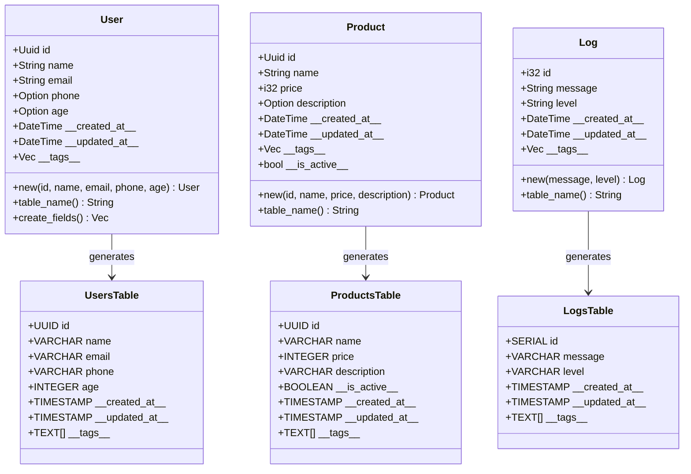

# Model Definitions

This guide covers how to define data models in StoreHaus using derive macros and attributes.

## Model Structure and SQL Generation

StoreHaus provides automatic SQL generation and system field management for your data models:



### Model Annotations
- **User Model**: `#[model]` with `#[soft_delete]` - Custom soft delete field
- **Product Model**: `#[model]` with `#[table(auto_soft_delete)]` - Automatic soft delete
- **Log Model**: `#[model]` with `#[table(auto_increment)]` - Auto-incrementing primary key

### Field Attributes Reference
- **`#[primary_key]`** - Primary key field
- **`#[field(create)]`** - Used in INSERT operations
- **`#[field(update)]`** - Used in UPDATE operations
- **`#[field(create, update)]`** - Used in both operations
- **`#[field(readonly)]`** - Never modified by StoreHaus
- **`#[soft_delete]`** - Soft delete field

### System Fields (Automatic)
- **`\_\_created_at\_\_`** - Creation timestamp
- **`\_\_updated_at\_\_`** - Last update timestamp
- **`\_\_tags\_\_`** - Operation tags array
- **`\_\_is_active\_\_`** - Soft delete flag (when using soft delete)

## Basic Model Definition

### Simple Model

```rust
use storehaus::prelude::*;

#[model]
#[table(name = "users")]
pub struct User {
    #[primary_key]
    pub id: Uuid,

    #[field(create, update)]
    pub name: String,

    #[field(create, update)]
    pub email: String,

    #[field(create, update)]
    pub phone: Option<String>,

    #[field(create, update)]
    pub age: Option<i32>,
}
```

### Model with Auto Soft Delete

```rust
#[model]
#[table(name = "products", auto_soft_delete)]
pub struct Product {
    #[primary_key]
    pub id: Uuid,

    #[field(create, update)]
    pub name: String,

    #[field(create, update)]
    pub price: i32,

    #[field(create, update)]
    pub description: Option<String>,
}
```

> **Note**: With `#[table(auto_soft_delete)]`, the `__is_active__` field is automatically added by the macro. You don't need to define it manually.

### Model with Custom Soft Delete Field

```rust
#[model]
#[table(name = "users")]
pub struct User {
    #[primary_key]
    pub id: Uuid,

    #[field(create, update)]
    pub name: String,

    #[field(create, update)]
    pub email: String,

    #[soft_delete]
    pub __is_active__: bool,
}
```

> **Note**: With `#[soft_delete]`, you manually define the soft delete field and have full control over its name and behavior.

### Model with Auto Increment

```rust
#[model]
#[table(name = "logs", auto_increment)]
pub struct Log {
    #[primary_key]
    pub id: i32,

    #[field(create, update)]
    pub message: String,

    #[field(create, update)]
    pub level: String,
}
```

> **Note**: With `#[table(auto_increment)]`, the primary key field will be automatically incremented by PostgreSQL. The primary key must be an integer type (`i32`, `i64`).

## Creating Model Instances

### Using Model::new() Method

The `#[model]` macro automatically generates a `new()` method that initializes system fields for you:

```rust
// The macro generates this for the User model:
impl User {
    pub fn new(
        id: Uuid,
        name: String,
        email: String,
        phone: Option<String>,
        age: Option<i32>
    ) -> Self {
        Self {
            id,
            name,
            email,
            phone,
            age,
            \_\_created_at\_\_: Utc::now(),
            \_\_updated_at\_\_: Utc::now(),
            \_\_tags\_\_: Vec::new(),
        }
    }
}

// Usage
let user = User::new(
    Uuid::new_v4(),
    "John Doe".to_string(),
    "john@example.com".to_string(),
    Some("+1-555-0123".to_string()),
    Some(30),
);
```

### For Auto Soft Delete Models

Models with `auto_soft_delete` get the `__is_active__` field initialized automatically to `true`:

```rust
// For the Product model with auto_soft_delete:
let product = Product::new(
    Uuid::new_v4(),
    "Laptop".to_string(),
    99999, // $999.99 in cents
    Some("Gaming laptop".to_string()),
);
// \_\_is_active\_\_ is automatically set to true
```

### For Custom Soft Delete Models

Models with `#[soft_delete]` field must include it in the constructor:

```rust
// For the User model with custom soft delete:
let user = User::new(
    Uuid::new_v4(),
    "John Doe".to_string(),
    "john@example.com".to_string(),
    true, // __is_active__
);
```

### For Auto Increment Models

Models with `auto_increment` don't include the primary key in the constructor:

```rust
// For the Log model with auto_increment:
let log = Log::new(
    "Application started successfully".to_string(),
    "INFO".to_string(),
);
// id is automatically generated by PostgreSQL
```

### Manual Instantiation (Not Recommended)

You can still create instances manually, but you must provide all system fields:

```rust
let user = User {
    id: Uuid::new_v4(),
    name: "John Doe".to_string(),
    email: "john@example.com".to_string(),
    phone: Some("+1-555-0123".to_string()),
    age: Some(30),
    \_\_created_at\_\_: Utc::now(),
    \_\_updated_at\_\_: Utc::now(),
    \_\_tags\_\_: Vec::new(),
};
```

**Note:** Always prefer `Model::new()` as it ensures system fields are properly initialized.

## Attributes Reference

### Model Attributes

#### `#[model]`
Basic model macro for database table generation and CRUD operations.

### Table Attributes

#### `#[table(name = "table_name")]`
Specifies the database table name for the model.

#### `#[table(name = "table_name", auto_soft_delete)]`
Enables automatic soft delete functionality. Adds an `__is_active__` field automatically.

```rust
#[table(name = "products", auto_soft_delete)]
```

#### `#[table(name = "table_name", auto_increment)]`
Enables auto-increment for the primary key field. Primary key must be an integer type.

```rust
#[table(name = "logs", auto_increment)]
```

You can combine multiple table options:

```rust
#[table(name = "comments", auto_soft_delete, auto_increment)]
```

### Field Attributes

#### `#[primary_key]`
Marks the field as the primary key. Required for every model.

```rust
#[primary_key]
pub id: Uuid,
```

#### `#[field(create, update)]`
Field can be set during create and update operations.

```rust
#[field(create, update)]
pub name: String,
```

#### `#[field(create)]`
Field can only be set during create operation (readonly after creation).

```rust
#[field(create)]
pub created_by: Uuid,
```

#### `#[field(update)]`
Field can only be updated, not set during creation.

```rust
#[field(update)]
pub last_modified_by: Option<Uuid>,
```

#### `#[soft_delete]`
Marks a boolean field as the soft delete flag. Gives you full control over the soft delete field name.

```rust
#[soft_delete]
pub __is_active__: bool,
```

#### `#[field(readonly)]`
Field is readonly and managed by the system (deprecated - use system fields instead).

```rust
#[field(readonly)]
pub computed_value: String,
```

### Database Indexes

StoreHaus supports creating database indexes to improve query performance. You can create both single-field and composite indexes using simple attributes.

#### `#[index]` - Single Field Index

Marks a field for indexing. Creates a B-tree index on the field to speed up queries.

```rust
#[field(create, update)]
#[index]
pub name: String,
```

Generated SQL:
```sql
CREATE INDEX IF NOT EXISTS idx_users_name ON "users" ("name")
```

#### `#[unique]` - Single Field Unique Index

Marks a field as unique. Creates a unique constraint index that prevents duplicate values.

```rust
#[field(create, update)]
#[unique]
pub email: String,
```

Generated SQL:
```sql
CREATE UNIQUE INDEX IF NOT EXISTS idx_users_email_unique ON "users" ("email")
```

#### Composite Indexes

For queries that filter on multiple fields together, you can create composite indexes at the struct level.

##### `#[index(field1, field2, ...)]` - Composite Index

Creates a multi-column index for queries that filter on multiple fields:

```rust
#[model]
#[table(name = "records")]
#[index(user_id, created_at)]
pub struct Record {
    #[primary_key]
    pub id: Uuid,

    #[field(create)]
    pub user_id: Uuid,

    #[field(create, update)]
    pub data: String,
}
```

Generated SQL:
```sql
CREATE INDEX IF NOT EXISTS idx_records_user_id_created_at
ON "records" ("user_id", "__created_at__")
```

##### `#[unique(field1, field2, ...)]` - Composite Unique Index

Creates a multi-column unique constraint, ensuring the combination of values is unique:

```rust
#[model]
#[table(name = "user_preferences")]
#[unique(user_id, preference_key)]
pub struct UserPreference {
    #[primary_key]
    pub id: Uuid,

    #[field(create)]
    pub user_id: Uuid,

    #[field(create)]
    pub preference_key: String,

    #[field(create, update)]
    pub preference_value: String,
}
```

Generated SQL:
```sql
CREATE UNIQUE INDEX IF NOT EXISTS idx_user_preferences_user_id_preference_key_unique
ON "user_preferences" ("user_id", "preference_key")
```

#### Complete Index Example

Here's a model demonstrating all index types:

```rust
use storehaus::prelude::*;
use uuid::Uuid;

#[model]
#[table(name = "products")]
#[index(category_id, price)]           // Composite index for filtered queries
#[unique(sku)]                          // Alternative to field-level #[unique]
pub struct Product {
    #[primary_key]
    pub id: Uuid,

    #[field(create, update)]
    #[unique]                            // Unique constraint on email
    pub email: String,

    #[field(create, update)]
    #[index]                             // Regular index on name for searches
    pub name: String,

    #[field(create, update)]
    pub category_id: Uuid,

    #[field(create, update)]
    pub price: i32,

    #[field(create)]
    pub sku: String,                     // Unique via struct-level attribute
}
```

This generates the following indexes:
```sql
-- Single field unique index
CREATE UNIQUE INDEX IF NOT EXISTS idx_products_email_unique ON "products" ("email");

-- Single field index
CREATE INDEX IF NOT EXISTS idx_products_name ON "products" ("name");

-- Composite index
CREATE INDEX IF NOT EXISTS idx_products_category_id_price ON "products" ("category_id", "price");

-- Composite unique index
CREATE UNIQUE INDEX IF NOT EXISTS idx_products_sku_unique ON "products" ("sku");
```

#### Index Best Practices

**When to use indexes:**
- Fields frequently used in WHERE clauses
- Fields used for sorting (ORDER BY)
- Fields used in JOIN operations
- Foreign key fields
- Email addresses and other unique identifiers

**Performance considerations:**
- Indexes speed up reads but slow down writes (INSERT/UPDATE/DELETE)
- Don't over-index - each index uses disk space and maintenance overhead
- Composite indexes are most effective when query filters match the index column order
- The order matters: `#[index(user_id, created_at)]` optimizes queries filtering by `user_id` first

**Unique indexes for data integrity:**
- Use `#[unique]` to enforce business rules at the database level
- Prevents race conditions that application-level validation can't catch
- Essential for emails, usernames, SKUs, and other identifiers that must be unique

**System field indexes:**
- System fields like `__created_at__` and `__updated_at__` can be included in composite indexes
- Useful for queries like "all records for user X created after date Y"
- Example: `#[index(user_id, __created_at__)]`

## Supported Field Types

### Basic Types

```rust
pub name: String,              // VARCHAR
pub age: i32,                  // INTEGER
pub height: f64,               // DOUBLE PRECISION
pub enabled: bool,             // BOOLEAN
```

### Optional Types

```rust
pub middle_name: Option<String>,    // Nullable VARCHAR
pub score: Option<i32>,             // Nullable INTEGER
```

### UUID Types

```rust
use uuid::Uuid;

pub id: Uuid,                  // UUID primary key
pub parent_id: Option<Uuid>,   // Nullable UUID foreign key
```

### DateTime Types

```rust
use chrono::{DateTime, Utc};

pub birth_date: DateTime<Utc>, // TIMESTAMP WITH TIME ZONE
pub \_\_updated_at\_\_: DateTime<Utc>, // Automatic timestamp
```

### JSON Types

```rust
use serde_json::Value;

pub metadata: Value,           // JSONB
pub config: Option<Value>,     // Nullable JSONB
```

## System Fields

System fields are automatically managed by StoreHaus and should **not** be included in your model definition:

- `\_\_created_at\_\_` - Automatically set on creation
- `\_\_updated_at\_\_` - Automatically updated on modification
- `\_\_is_active\_\_` - Added when using `#[model(soft)]`, or custom field name when using `#[soft_delete]`
- `\_\_tags\_\_` - Array of operation tags

These fields are automatically added to your database table and are available in the generated SQL, but they don't appear in your Rust struct definition.

## Complete Example

```rust
use table_derive::model;
use uuid::Uuid;
use chrono::{DateTime, Utc};
use serde_json::Value;

#[model(soft)]
#[table(name = "blog_posts")]
pub struct BlogPost {
    #[primary_key]
    pub id: Uuid,

    #[field(create, update)]
    pub title: String,

    #[field(create, update)]
    pub content: String,

    #[field(create, update)]
    pub author_id: Uuid,

    #[field(create)]
    pub slug: String,

    #[field(update)]
    pub published_at: Option<DateTime<Utc>>,

    #[field(create, update)]
    pub metadata: Option<Value>,

    #[field(create, update)]
    pub tags_array: Vec<String>,
}
```

This will generate a table with:
- Your defined fields: `id`, `title`, `content`, `author_id`, `slug`, `published_at`, `metadata`, `tags_array`
- System fields: `\_\_created_at\_\_`, `\_\_updated_at\_\_`, `\_\_is_active\_\_`, `\_\_tags\_\_`

## Generated Code

The `#[model]` macro automatically generates:

1. **TableMetadata trait implementation** - Provides table name, field information, and SQL generation
2. **Database derives** - `Debug`, `Clone`, `Serialize`, `Deserialize`, `FromRow`, `Type`
3. **System field management** - SQL for automatic timestamp and soft delete fields
4. **CRUD methods** - Create, update, and delete SQL generation

## Best Practices

### Naming Conventions

- Use `snake_case` for field names
- Use `PascalCase` for struct names
- Use descriptive table names in `#[table(name = "...")]`

### Field Organization

```rust
#[model(soft)]
#[table(name = "users")]
pub struct User {
    // Primary key first
    #[primary_key]
    pub id: Uuid,

    // Required fields
    #[field(create, update)]
    pub name: String,

    #[field(create, update)]
    pub email: String,

    // Optional fields
    #[field(create, update)]
    pub bio: Option<String>,

    // Create-only fields
    #[field(create)]
    pub created_by: Uuid,

    // Update-only fields
    #[field(update)]
    pub last_login: Option<DateTime<Utc>>,

    // Complex types last
    #[field(create, update)]
    pub preferences: Option<Value>,
}
```

### Error Handling

Common compilation errors and solutions:

#### Missing primary key (Optional)
Primary keys are now optional in StoreHaus. Models can be created without a `#[primary_key]` field for use cases like settings tables or key-value stores.

When a model has no primary key:
- `type Id = ()`
- `extract_id()` returns `()`
- `primary_key_field()` returns `""`
- `update_sql()`, `delete_by_id_sql()`, and `get_by_id_sql()` return empty strings
- You must build custom queries for updates and lookups

#### Invalid field attribute
```
error: Invalid field attribute combination
```
Solution: Use valid combinations like `create`, `update`, `create, update`, or `readonly`.

#### Unsupported type
```
error: Type doesn't implement required traits
```
Solution: Ensure your type implements `Debug`, `Clone`, `Serialize`, `Deserialize`, and `sqlx` traits.