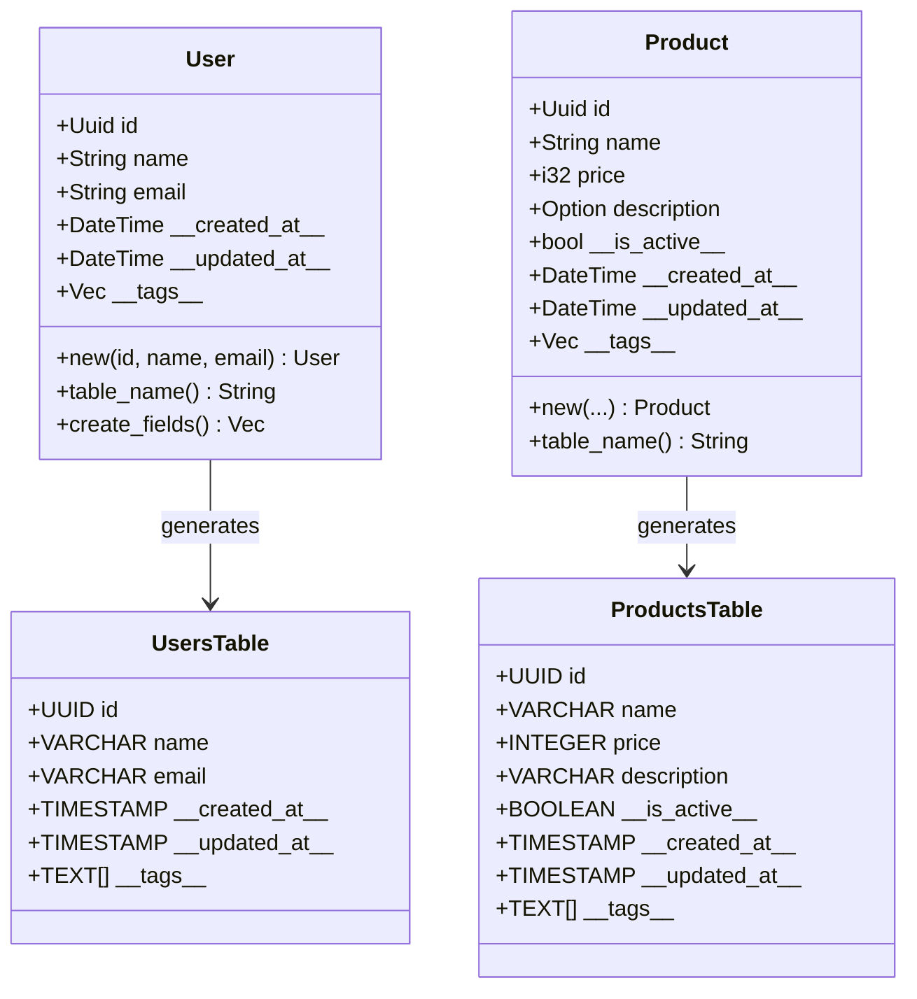

# Model Definitions

This guide covers how to define data models in StoreHaus using derive macros and attributes.

## Model Structure and SQL Generation

StoreHaus provides automatic SQL generation and system field management for your data models:



### Model Annotations
- **User Model**: `#[model]` - Simple model with automatic system fields
- **Product Model**: `#[model]` with `#[soft_delete]` - Includes soft delete functionality

### Field Attributes Reference
- **`#[primary_key]`** - Primary key field
- **`#[field(create)]`** - Used in INSERT operations
- **`#[field(update)]`** - Used in UPDATE operations
- **`#[field(create, update)]`** - Used in both operations
- **`#[field(readonly)]`** - Never modified by StoreHaus
- **`#[soft_delete]`** - Soft delete field

### System Fields (Automatic)
- **`\_\_created_at\_\_`** - Creation timestamp
- **`\_\_updated_at\_\_`** - Last update timestamp
- **`\_\_tags\_\_`** - Operation tags array
- **`\_\_is_active\_\_`** - Soft delete flag (when using soft delete)

## Basic Model Definition

### Simple Model

```rust
use storehaus::prelude::*;

#[model]
#[table(name = "users")]
pub struct User {
    #[primary_key]
    pub id: Uuid,

    #[field(create, update)]
    pub name: String,

    #[field(create, update)]
    pub email: String,
}
```

### Model with Soft Delete

```rust
#[model]
#[table(name = "products")]
pub struct Product {
    #[primary_key]
    pub id: Uuid,

    #[field(create, update)]
    pub name: String,

    #[field(create, update)]
    pub price: i32,

    #[field(create, update)]
    pub description: Option<String>,

    #[soft_delete]
    pub \_\_is_active\_\_: bool,
}
```

## Creating Model Instances

### Using Model::new() Method

The `#[model]` macro automatically generates a `new()` method that initializes system fields for you:

```rust
// The macro generates this for the User model:
impl User {
    pub fn new(id: Uuid, name: String, email: String) -> Self {
        Self {
            id,
            name,
            email,
            \_\_created_at\_\_: Utc::now(),
            \_\_updated_at\_\_: Utc::now(),
            \_\_tags\_\_: Vec::new(),
        }
    }
}

// Usage
let user = User::new(
    Uuid::new_v4(),
    "John Doe".to_string(),
    "john@example.com".to_string(),
);
```

### For Soft Delete Models

Models with soft delete fields also get the field initialized:

```rust
// For the Product model with soft delete:
let product = Product::new(
    Uuid::new_v4(),
    "Laptop".to_string(),
    99999, // $999.99 in cents
    Some("Gaming laptop".to_string()),
    true,  // \_\_is_active\_\_
);
```

### Manual Instantiation (Not Recommended)

You can still create instances manually, but you must provide all system fields:

```rust
let user = User {
    id: Uuid::new_v4(),
    name: "John Doe".to_string(),
    email: "john@example.com".to_string(),
    \_\_created_at\_\_: Utc::now(),
    \_\_updated_at\_\_: Utc::now(),
    \_\_tags\_\_: Vec::new(),
};
```

**Note:** Always prefer `Model::new()` as it ensures system fields are properly initialized.

## Attributes Reference

### Model Attributes

#### `#[model]`
Basic model without soft delete support.

#### `#[model]`

### Table Attributes

#### `#[table(name = "table_name")]`
Specifies the database table name for the model.

### Field Attributes

#### `#[primary_key]`
Marks the field as the primary key. Required for every model.

```rust
#[primary_key]
pub id: Uuid,
```

#### `#[field(create, update)]`
Field can be set during create and update operations.

```rust
#[field(create, update)]
pub name: String,
```

#### `#[field(create)]`
Field can only be set during create operation (readonly after creation).

```rust
#[field(create)]
pub created_by: Uuid,
```

#### `#[field(update)]`
Field can only be updated, not set during creation.

```rust
#[field(update)]
pub last_modified_by: Option<Uuid>,
```

#### `#[soft_delete]`
Marks a boolean field as the soft delete flag. Only one field per model can have this attribute.

```rust
#[soft_delete]
pub is_enabled: bool,
```

#### `#[field(readonly)]`
Field is readonly and managed by the system (deprecated - use system fields instead).

```rust
#[field(readonly)]
pub computed_value: String,
```

## Supported Field Types

### Basic Types

```rust
pub name: String,              // VARCHAR
pub age: i32,                  // INTEGER
pub height: f64,               // DOUBLE PRECISION
pub enabled: bool,             // BOOLEAN
```

### Optional Types

```rust
pub middle_name: Option<String>,    // Nullable VARCHAR
pub score: Option<i32>,             // Nullable INTEGER
```

### UUID Types

```rust
use uuid::Uuid;

pub id: Uuid,                  // UUID primary key
pub parent_id: Option<Uuid>,   // Nullable UUID foreign key
```

### DateTime Types

```rust
use chrono::{DateTime, Utc};

pub birth_date: DateTime<Utc>, // TIMESTAMP WITH TIME ZONE
pub \_\_updated_at\_\_: DateTime<Utc>, // Automatic timestamp
```

### JSON Types

```rust
use serde_json::Value;

pub metadata: Value,           // JSONB
pub config: Option<Value>,     // Nullable JSONB
```

## System Fields

System fields are automatically managed by StoreHaus and should **not** be included in your model definition:

- `\_\_created_at\_\_` - Automatically set on creation
- `\_\_updated_at\_\_` - Automatically updated on modification
- `\_\_is_active\_\_` - Added when using `#[model(soft)]`, or custom field name when using `#[soft_delete]`
- `\_\_tags\_\_` - Array of operation tags

These fields are automatically added to your database table and are available in the generated SQL, but they don't appear in your Rust struct definition.

## Complete Example

```rust
use table_derive::model;
use uuid::Uuid;
use chrono::{DateTime, Utc};
use serde_json::Value;

#[model(soft)]
#[table(name = "blog_posts")]
pub struct BlogPost {
    #[primary_key]
    pub id: Uuid,

    #[field(create, update)]
    pub title: String,

    #[field(create, update)]
    pub content: String,

    #[field(create, update)]
    pub author_id: Uuid,

    #[field(create)]
    pub slug: String,

    #[field(update)]
    pub published_at: Option<DateTime<Utc>>,

    #[field(create, update)]
    pub metadata: Option<Value>,

    #[field(create, update)]
    pub tags_array: Vec<String>,
}
```

This will generate a table with:
- Your defined fields: `id`, `title`, `content`, `author_id`, `slug`, `published_at`, `metadata`, `tags_array`
- System fields: `\_\_created_at\_\_`, `\_\_updated_at\_\_`, `\_\_is_active\_\_`, `\_\_tags\_\_`

## Generated Code

The `#[model]` macro automatically generates:

1. **TableMetadata trait implementation** - Provides table name, field information, and SQL generation
2. **Database derives** - `Debug`, `Clone`, `Serialize`, `Deserialize`, `FromRow`, `Type`
3. **System field management** - SQL for automatic timestamp and soft delete fields
4. **CRUD methods** - Create, update, and delete SQL generation

## Best Practices

### Naming Conventions

- Use `snake_case` for field names
- Use `PascalCase` for struct names
- Use descriptive table names in `#[table(name = "...")]`

### Field Organization

```rust
#[model(soft)]
#[table(name = "users")]
pub struct User {
    // Primary key first
    #[primary_key]
    pub id: Uuid,

    // Required fields
    #[field(create, update)]
    pub name: String,

    #[field(create, update)]
    pub email: String,

    // Optional fields
    #[field(create, update)]
    pub bio: Option<String>,

    // Create-only fields
    #[field(create)]
    pub created_by: Uuid,

    // Update-only fields
    #[field(update)]
    pub last_login: Option<DateTime<Utc>>,

    // Complex types last
    #[field(create, update)]
    pub preferences: Option<Value>,
}
```

### Error Handling

Common compilation errors and solutions:

#### Missing primary key
```
error: Model must have exactly one #[primary_key] field
```
Solution: Add `#[primary_key]` to exactly one field.

#### Invalid field attribute
```
error: Invalid field attribute combination
```
Solution: Use valid combinations like `create`, `update`, `create, update`, or `readonly`.

#### Unsupported type
```
error: Type doesn't implement required traits
```
Solution: Ensure your type implements `Debug`, `Clone`, `Serialize`, `Deserialize`, and `sqlx` traits.