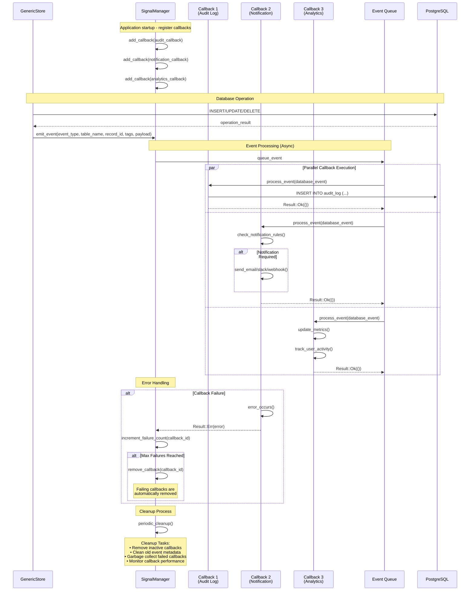

# Signal System

StoreHaus includes a comprehensive signal system that monitors all database operations and emits structured events. This system is perfect for implementing audit trails, real-time notifications, WAL (Write-Ahead Log) systems, and external integrations.

## Overview

The signal system provides comprehensive event processing with parallel callback execution and robust error handling:



### Event Structure
```rust
pub struct DatabaseEvent {
    pub event_type: EventType,        // Create | Update | Delete
    pub table_name: String,           // Target table
    pub record_id: Option<String>,    // Primary key
    pub tags: Vec<String>,            // Operation tags
    pub payload: HashMap<String, PostgresValue>, // Field data
    pub timestamp: DateTime<Utc>,     // Event timestamp
}
```

### Configuration Options
```rust
pub struct SignalConfig {
    pub callback_timeout_seconds: u64,          // 30
    pub max_callbacks: usize,                   // 100
    pub remove_failing_callbacks: bool,         // true
    pub max_consecutive_failures: u32,          // 3
    pub cleanup_interval_seconds: u64,          // 60
    pub auto_remove_inactive_callbacks: bool,   // true
    pub inactive_callback_threshold_seconds: u64, // 300
}
```

The signal system provides:

- **Real-time event monitoring** for all CRUD operations
- **Structured event data** with payload serialization
- **Tag integration** for operation categorization
- **Callback system** for custom event handlers
- **Type-safe event handling** with PostgreSQL value types
- **Async event processing** without blocking database operations

## Basic Setup

### Creating a Signal Manager

```rust
use storehaus::prelude::*;
use std::sync::Arc;

#[tokio::main]
async fn main() -> Result<(), Box<dyn std::error::Error>> {
    // Create signal manager
    let signal_manager = Arc::new(SignalManager::new());

    // Add a simple callback
    signal_manager.add_callback(|event: &DatabaseEvent| {
        println!("Database operation: {:?} on table {}",
                event.event_type, event.table_name);
    });

    // Create store with signal manager
    let user_store = GenericStore::<User>::new(
        db_pool,
        Some(signal_manager.clone()), // Enable signals
        None,                         // No cache
    );

    Ok(())
}
```

### Event Types

The signal system monitors these operation types:

```rust
use signal_system::EventType;

// Available event types
EventType::Create  // New record creation
EventType::Update  // Record modification
EventType::Delete  // Record deletion (including soft delete)
```

## Event Structure

### DatabaseEvent Fields

```rust
pub struct DatabaseEvent {
    pub id: Option<i64>,                    // Auto-increment event ID
    pub event_type: EventType,              // Create/Update/Delete
    pub table_name: String,                 // Target table name
    pub record_id: Option<String>,          // Primary key of affected record
    pub tags: Vec<String>,                  // Operation tags
    pub payload: HashMap<String, PostgresValue>, // Field data
    pub timestamp: DateTime<Utc>,           // Event timestamp
}
```

### PostgresValue Types

Payload data is serialized to PostgreSQL-compatible types:

```rust
pub enum PostgresValue {
    Text(String),           // VARCHAR, TEXT
    Integer(i32),           // INTEGER
    BigInt(i64),            // BIGINT
    Float(f64),             // DOUBLE PRECISION
    Boolean(bool),          // BOOLEAN
    Json(serde_json::Value), // JSONB
    Uuid(String),           // UUID as string
    Timestamp(DateTime<Utc>), // TIMESTAMP WITH TIME ZONE
    Array(Vec<PostgresValue>), // Arrays
}
```

## Event Handlers

### Simple Callbacks

```rust
// Log all database operations
signal_manager.add_callback(|event: &DatabaseEvent| {
    println!("[{}] {} on {} (ID: {:?})",
        event.timestamp.format("%Y-%m-%d %H:%M:%S"),
        event.event_type,
        event.table_name,
        event.record_id
    );
});

// Monitor specific tables
signal_manager.add_callback(|event: &DatabaseEvent| {
    if event.table_name == "users" {
        println!("User operation: {:?}", event.event_type);

        // Access field data
        if let Some(name) = event.payload.get("name") {
            println!("User name: {:?}", name);
        }
    }
});
```

### Conditional Processing

```rust
// Handle different event types
signal_manager.add_callback(|event: &DatabaseEvent| {
    match event.event_type {
        EventType::Create => handle_create_event(event),
        EventType::Update => handle_update_event(event),
        EventType::Delete => handle_delete_event(event),
    }
});

fn handle_create_event(event: &DatabaseEvent) {
    println!("New {} created with ID: {:?}",
        event.table_name, event.record_id);

    // Send welcome email for user creation
    if event.table_name == "users" {
        if let Some(email) = event.payload.get("email") {
            send_welcome_email(email);
        }
    }
}

fn handle_update_event(event: &DatabaseEvent) {
    println!("Updated {} with ID: {:?}",
        event.table_name, event.record_id);

    // Track profile changes
    if event.table_name == "users" && event.payload.contains_key("email") {
        log_email_change(event);
    }
}

fn handle_delete_event(event: &DatabaseEvent) {
    println!("Deleted {} with ID: {:?}",
        event.table_name, event.record_id);

    // Cleanup related data
    if let Some(record_id) = event.record_id.as_ref() {
        cleanup_user_data(record_id);
    }
}
```

### Tag-Based Processing

```rust
// Process events based on tags
signal_manager.add_callback(|event: &DatabaseEvent| {
    // Handle audit-required operations
    if event.tags.contains(&"audit:required".to_string()) {
        send_to_audit_system(event);
    }

    // Handle high-priority operations
    if event.tags.iter().any(|tag| tag.starts_with("priority:high")) {
        send_priority_alert(event);
    }

    // Handle campaign tracking
    for tag in &event.tags {
        if tag.starts_with("campaign:") {
            track_campaign_conversion(tag, event);
        }
    }
});
```

## Advanced Use Cases

### Audit Trail Implementation

```rust
use serde::{Serialize, Deserialize};

#[derive(Serialize, Deserialize)]
pub struct AuditLog {
    pub event_id: i64,
    pub table_name: String,
    pub operation: String,
    pub record_id: String,
    pub user_id: Option<String>,
    pub changes: serde_json::Value,
    pub timestamp: DateTime<Utc>,
    pub tags: Vec<String>,
}

// Comprehensive audit trail
signal_manager.add_callback(|event: &DatabaseEvent| {
    let audit_entry = AuditLog {
        event_id: event.id.unwrap_or(0),
        table_name: event.table_name.clone(),
        operation: format!("{:?}", event.event_type),
        record_id: event.record_id.clone().unwrap_or_default(),
        user_id: extract_user_id_from_tags(&event.tags),
        changes: serialize_payload_to_json(&event.payload),
        timestamp: event.timestamp,
        tags: event.tags.clone(),
    };

    // Store in audit database
    tokio::spawn(async move {
        store_audit_log(audit_entry).await;
    });
});

fn extract_user_id_from_tags(tags: &[String]) -> Option<String> {
    tags.iter()
        .find(|tag| tag.starts_with("user:"))
        .map(|tag| tag.strip_prefix("user:").unwrap_or("").to_string())
}
```

### Real-Time Notifications

```rust
use tokio::sync::mpsc;

// Setup notification channel
let (tx, mut rx) = mpsc::unbounded_channel::<DatabaseEvent>();

// Send events to notification channel
signal_manager.add_callback(move |event: &DatabaseEvent| {
    if should_notify(event) {
        let _ = tx.send(event.clone());
    }
});

// Process notifications asynchronously
tokio::spawn(async move {
    while let Some(event) = rx.recv().await {
        handle_notification(event).await;
    }
});

fn should_notify(event: &DatabaseEvent) -> bool {
    // Only notify for user operations with specific tags
    event.table_name == "users" &&
    event.tags.iter().any(|tag| tag.starts_with("notify:"))
}

async fn handle_notification(event: DatabaseEvent) {
    match event.event_type {
        EventType::Create => send_user_welcome_notification(&event).await,
        EventType::Update => send_profile_update_notification(&event).await,
        EventType::Delete => send_account_deletion_notification(&event).await,
    }
}
```

### WAL (Write-Ahead Log) System

```rust
use std::fs::OpenOptions;
use std::io::Write;

// File-based WAL implementation
signal_manager.add_callback(|event: &DatabaseEvent| {
    let wal_entry = format!(
        "{}\t{}\t{}\t{:?}\t{}\t{}\n",
        event.timestamp.timestamp(),
        event.event_type,
        event.table_name,
        event.record_id,
        serde_json::to_string(&event.payload).unwrap_or_default(),
        event.tags.join(",")
    );

    // Write to WAL file (use proper error handling in production)
    tokio::spawn(async move {
        if let Ok(mut file) = OpenOptions::new()
            .create(true)
            .append(true)
            .open("database.wal")
        {
            let _ = writeln!(file, "{}", wal_entry);
        }
    });
});

// WAL replay function
async fn replay_wal_from_timestamp(since: DateTime<Utc>) -> Result<(), Box<dyn std::error::Error>> {
    let wal_content = tokio::fs::read_to_string("database.wal").await?;

    for line in wal_content.lines() {
        let parts: Vec<&str> = line.split('\t').collect();
        if parts.len() >= 6 {
            let timestamp = parts[0].parse::<i64>()?;
            if let Some(event_time) = DateTime::from_timestamp(timestamp, 0) {
                if event_time >= since {
                    println!("Replaying: {} {} on {}",
                        parts[1], parts[2], parts[3]);
                    // Implement actual replay logic here
                }
            }
        }
    }

    Ok(())
}
```

### Metrics and Analytics

```rust
use std::sync::atomic::{AtomicU64, Ordering};
use std::collections::HashMap;

// Global metrics
static CREATE_COUNT: AtomicU64 = AtomicU64::new(0);
static UPDATE_COUNT: AtomicU64 = AtomicU64::new(0);
static DELETE_COUNT: AtomicU64 = AtomicU64::new(0);

// Metrics collection
signal_manager.add_callback(|event: &DatabaseEvent| {
    match event.event_type {
        EventType::Create => {
            CREATE_COUNT.fetch_add(1, Ordering::Relaxed);
        }
        EventType::Update => {
            UPDATE_COUNT.fetch_add(1, Ordering::Relaxed);
        }
        EventType::Delete => {
            DELETE_COUNT.fetch_add(1, Ordering::Relaxed);
        }
    }

    // Table-specific metrics
    update_table_metrics(&event.table_name, &event.event_type);

    // Tag-based metrics
    for tag in &event.tags {
        update_tag_metrics(tag);
    }
});

// Periodic metrics reporting
async fn report_metrics() {
    loop {
        tokio::time::sleep(std::time::Duration::from_secs(60)).await;

        println!("Database Operations (last minute):");
        println!("  Creates: {}", CREATE_COUNT.load(Ordering::Relaxed));
        println!("  Updates: {}", UPDATE_COUNT.load(Ordering::Relaxed));
        println!("  Deletes: {}", DELETE_COUNT.load(Ordering::Relaxed));

        // Reset counters
        CREATE_COUNT.store(0, Ordering::Relaxed);
        UPDATE_COUNT.store(0, Ordering::Relaxed);
        DELETE_COUNT.store(0, Ordering::Relaxed);
    }
}
```

## Integration Examples

### External System Integration

```rust
// Send events to external message queue
signal_manager.add_callback(|event: &DatabaseEvent| {
    let message = serde_json::json!({
        "type": "database_event",
        "event_type": event.event_type,
        "table": event.table_name,
        "record_id": event.record_id,
        "tags": event.tags,
        "timestamp": event.timestamp,
        "payload": event.payload
    });

    // Send to message queue (RabbitMQ, Apache Kafka, etc.)
    tokio::spawn(async move {
        send_to_message_queue("database_events", message).await;
    });
});
```

### Search Index Synchronization

```rust
// Keep search index in sync with database
signal_manager.add_callback(|event: &DatabaseEvent| {
    if event.table_name == "users" || event.table_name == "products" {
        let record_id = event.record_id.clone().unwrap_or_default();

        tokio::spawn(async move {
            match event.event_type {
                EventType::Create | EventType::Update => {
                    update_search_index(&event.table_name, &record_id, &event.payload).await;
                }
                EventType::Delete => {
                    remove_from_search_index(&event.table_name, &record_id).await;
                }
            }
        });
    }
});
```

### Cache Warming

```rust
// Warm related caches after operations
signal_manager.add_callback(|event: &DatabaseEvent| {
    if event.event_type == EventType::Create && event.table_name == "users" {
        if let Some(user_id) = &event.record_id {
            // Warm frequently accessed user data
            tokio::spawn(async move {
                warm_user_cache(user_id).await;
            });
        }
    }
});
```

## Performance Considerations

### Async Processing

Callbacks should be lightweight and non-blocking:

```rust
// Good: Async processing
signal_manager.add_callback(|event: &DatabaseEvent| {
    let event_clone = event.clone();
    tokio::spawn(async move {
        heavy_processing(event_clone).await;
    });
});

// Avoid: Blocking operations in callbacks
signal_manager.add_callback(|event: &DatabaseEvent| {
    // DON'T DO THIS - blocks the database operation
    std::thread::sleep(std::time::Duration::from_secs(1));
    heavy_blocking_processing(event);
});
```

### Error Handling

Handle errors gracefully in callbacks:

```rust
signal_manager.add_callback(|event: &DatabaseEvent| {
    tokio::spawn(async move {
        match process_event(event).await {
            Ok(_) => log::debug!("Event processed successfully"),
            Err(e) => log::error!("Failed to process event: {}", e),
        }
    });
});
```

### Memory Management

Avoid accumulating data in callbacks:

```rust
// Avoid: Unbounded data accumulation
static mut EVENT_HISTORY: Vec<DatabaseEvent> = Vec::new();

// Better: Bounded collections or external storage
use std::collections::VecDeque;
use parking_lot::Mutex;

static EVENT_BUFFER: Mutex<VecDeque<DatabaseEvent>> = Mutex::new(VecDeque::new());

signal_manager.add_callback(|event: &DatabaseEvent| {
    let mut buffer = EVENT_BUFFER.lock();
    buffer.push_back(event.clone());

    // Keep only last 1000 events
    while buffer.len() > 1000 {
        buffer.pop_front();
    }
});
```

## Best Practices

### Callback Organization

```rust
// Organize callbacks by purpose
fn setup_signal_handlers(signal_manager: Arc<SignalManager>) {
    // Audit trail
    signal_manager.add_callback(audit_callback);

    // Notifications
    signal_manager.add_callback(notification_callback);

    // Metrics
    signal_manager.add_callback(metrics_callback);

    // External integrations
    signal_manager.add_callback(external_system_callback);
}

fn audit_callback(event: &DatabaseEvent) {
    // Audit-specific logic
}

fn notification_callback(event: &DatabaseEvent) {
    // Notification logic
}
```

### Tag Conventions

```rust
// Use consistent tag patterns for easy filtering
let audit_tags = vec!["audit:required", "compliance:gdpr"];
let notification_tags = vec!["notify:email", "notify:push"];
let integration_tags = vec!["sync:elasticsearch", "sync:analytics"];
```

### Testing Signal Handlers

```rust
#[cfg(test)]
mod tests {
    use super::*;

    #[tokio::test]
    async fn test_audit_callback() {
        let signal_manager = Arc::new(SignalManager::new());
        let mut audit_events = Vec::new();

        // Test callback
        signal_manager.add_callback(|event: &DatabaseEvent| {
            // In real tests, use proper synchronization
            // This is simplified for demonstration
        });

        // Trigger events and verify handling
        // ...
    }
}
```